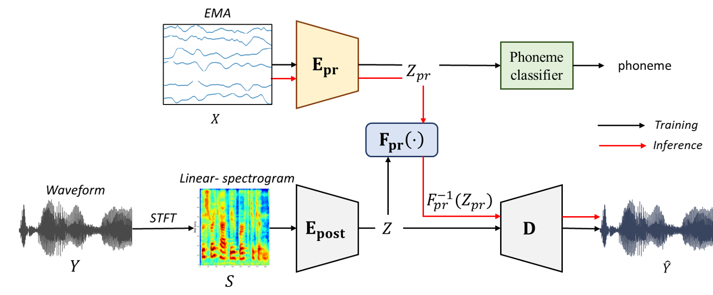

### Submitted to Interspeech (Paper number: 366)

## Abstract

Deep learning-based articulatory-to-speech (ATS) systems designed for individuals with speech disorders have been extensively researched in recent years. However, conventional methods have faced challenges in effectively representing the transformation in latent space across speech and electromagnetic articulography (EMA) domains, resulting in low speech quality. In this paper, we propose a variational autoencoder (VAE)-based end-to-end ATS model called PARAN that efficiently produces high-fidelity speech waveforms from EMA signals. Our model adjusts a prior distribution of latent representations from EMA signals to match a posterior distribution derived from speech waveforms through the utilization of a normalizing flow mechanism. To further enhance the clarity and understanding of the synthesized speech, we incorporate an additional loss function aimed at predicting phonetic information from EMA signals. Experimental results demonstrate that our model outperforms previous methods in terms of speech quality and intelligibility.

## Sample

Gaddy et al.: "An improved model for voicing silent speech" in ACL, 2021  
Wu et al.: “Deep speech synthesis from articulatory representations” in INTERSPEECH, 2022  
Kim et al.: “Style modeling for multispeaker articulation-to-speech” in ICASSP, 2023  

<table style="width: 100%; word-wrap: normal; text-align: center;" borded="1" border-collapse="collapse">
<tr>
<td style="column-width: 50\%"><strong>Sample index</strong></td>
<td style="column-width: 20\%"><strong>1</strong></td>
<td style="column-width: 20\%"><strong>2</strong></td>
<td style="column-width: 20\%"><strong>3</strong></td>
<td style="column-width: 20\%"><strong>4</strong></td>
<td style="column-width: 20\%"><strong>5</strong></td>
<td style="column-width: 20\%"><strong>6</strong></td>
<td style="column-width: 20\%"><strong>7</strong></td>
<td style="column-width: 20\%"><strong>8</strong></td>
<td style="column-width: 20\%"><strong>9</strong></td>
<td style="column-width: 20\%"><strong>10</strong></td>
<td style="column-width: 20\%"><strong>11</strong></td>
<td style="column-width: 20\%"><strong>12</strong></td>
<td style="column-width: 20\%"><strong>13</strong></td>
<td style="column-width: 20\%"><strong>14</strong></td>
<td style="column-width: 20\%"><strong>15</strong></td>
<td style="column-width: 20\%"><strong>16</strong></td>
<td style="column-width: 20\%"><strong>17</strong></td>
<td style="column-width: 20\%"><strong>18</strong></td>
<td style="column-width: 20\%"><strong>19</strong></td>
<td style="column-width: 20\%"><strong>20</strong></td>
<td style="column-width: 20\%"><strong>21</strong></td>
<td style="column-width: 20\%"><strong>22</strong></td>
<td style="column-width: 20\%"><strong>23</strong></td>
<td style="column-width: 20\%"><strong>24</strong></td>
</tr>
<tr>
<td style="column-width: 50\%"><strong>Reference</strong></td>
 <td><audio controls><source src='./demo_sample/ref/ref_F01_B04_S21_R01_N.wav'></audio></td>
<td><audio controls><source src='./demo_sample/ref/ref_F01_B06_S44_R01_N.wav'></audio></td>
<td><audio controls><source src='./demo_sample/ref/ref_F01_B07_S03_R01_F.wav'></audio></td>
<td><audio controls><source src='./demo_sample/ref/ref_F02_B01_S15_R01_F.wav'></audio></td>
<td><audio controls><source src='./demo_sample/ref/ref_F02_B03_S26_R01_N.wav'></audio></td>
<td><audio controls><source src='./demo_sample/ref/ref_F02_B10_S49_R01_N.wav'></audio></td>
<td><audio controls><source src='./demo_sample/ref/ref_F03_B01_S08_R01_N.wav'></audio></td>
<td><audio controls><source src='./demo_sample/ref/ref_F03_B06_S15_R01_F.wav'></audio></td>
<td><audio controls><source src='./demo_sample/ref/ref_F03_B07_S60_R01_N.wav'></audio></td>
<td><audio controls><source src='./demo_sample/ref/ref_F04_B02_S28_R02_N.wav'></audio></td>
<td><audio controls><source src='./demo_sample/ref/ref_F04_B02_S42_R01_F.wav'></audio></td>
<td><audio controls><source src='./demo_sample/ref/ref_F04_B09_S47_R01_N.wav'></audio></td>
<td><audio controls><source src='./demo_sample/ref/ref_M01_B03_S23_R01_N.wav'></audio></td>
<td><audio controls><source src='./demo_sample/ref/ref_M01_B06_S55_R01_N.wav'></audio></td>
<td><audio controls><source src='./demo_sample/ref/ref_M01_B08_S55_R01_F.wav'></audio></td>
<td><audio controls><source src='./demo_sample/ref/ref_M02_B01_S51_R01_N.wav'></audio></td>
<td><audio controls><source src='./demo_sample/ref/ref_M02_B10_S02_R01_N.wav'></audio></td>
<td><audio controls><source src='./demo_sample/ref/ref_M02_B11_S20_R01_N.wav'></audio></td>
<td><audio controls><source src='./demo_sample/ref/ref_M03_B02_S20_R01_N.wav'></audio></td>
<td><audio controls><source src='./demo_sample/ref/ref_M03_B04_S01_R01_F.wav'></audio></td>
<td><audio controls><source src='./demo_sample/ref/ref_M03_B10_S59_R01_N.wav'></audio></td>
<td><audio controls><source src='./demo_sample/ref/ref_M04_B03_S08_R01_N.wav'></audio></td>
<td><audio controls><source src='./demo_sample/ref/ref_M04_B03_S58_R02_N.wav'></audio></td>
<td><audio controls><source src='./demo_sample/ref/ref_M04_B10_S39_R01_F.wav'></audio></td>
</tr>
<tr>
<td style="column-width: 50\%"><strong>Gaddy et al.</strong></td>
 <td><audio controls><source src='./demo_sample/baseline/F01_B04_S21_R01_N.wav'></audio></td>
<td><audio controls><source src='./demo_sample/baseline/F01_B06_S44_R01_N.wav'></audio></td>
<td><audio controls><source src='./demo_sample/baseline/F01_B07_S03_R01_F.wav'></audio></td>
<td><audio controls><source src='./demo_sample/baseline/F02_B01_S15_R01_F.wav'></audio></td>
<td><audio controls><source src='./demo_sample/baseline/F02_B03_S26_R01_N.wav'></audio></td>
<td><audio controls><source src='./demo_sample/baseline/F02_B10_S49_R01_N.wav'></audio></td>
<td><audio controls><source src='./demo_sample/baseline/F03_B01_S08_R01_N.wav'></audio></td>
<td><audio controls><source src='./demo_sample/baseline/F03_B06_S15_R01_F.wav'></audio></td>
<td><audio controls><source src='./demo_sample/baseline/F03_B07_S60_R01_N.wav'></audio></td>
<td><audio controls><source src='./demo_sample/baseline/F04_B02_S28_R02_N.wav'></audio></td>
<td><audio controls><source src='./demo_sample/baseline/F04_B02_S42_R01_F.wav'></audio></td>
<td><audio controls><source src='./demo_sample/baseline/F04_B09_S47_R01_N.wav'></audio></td>
<td><audio controls><source src='./demo_sample/baseline/M01_B03_S23_R01_N.wav'></audio></td>
<td><audio controls><source src='./demo_sample/baseline/M01_B06_S55_R01_N.wav'></audio></td>
<td><audio controls><source src='./demo_sample/baseline/M01_B08_S55_R01_F.wav'></audio></td>
<td><audio controls><source src='./demo_sample/baseline/M02_B01_S51_R01_N.wav'></audio></td>
<td><audio controls><source src='./demo_sample/baseline/M02_B10_S02_R01_N.wav'></audio></td>
<td><audio controls><source src='./demo_sample/baseline/M02_B11_S20_R01_N.wav'></audio></td>
<td><audio controls><source src='./demo_sample/baseline/M03_B02_S20_R01_N.wav'></audio></td>
<td><audio controls><source src='./demo_sample/baseline/M03_B04_S01_R01_F.wav'></audio></td>
<td><audio controls><source src='./demo_sample/baseline/M03_B10_S59_R01_N.wav'></audio></td>
<td><audio controls><source src='./demo_sample/baseline/M04_B03_S08_R01_N.wav'></audio></td>
<td><audio controls><source src='./demo_sample/baseline/M04_B03_S58_R02_N.wav'></audio></td>
<td><audio controls><source src='./demo_sample/baseline/M04_B10_S39_R01_F.wav'></audio></td>
</tr>
<tr>
<td style="column-width: 50\%"><strong>Wu et al.</strong></td>
<td><audio controls><source src='./demo_sample/deep/F01_B04_S21_R01_N.wav'></audio></td>
<td><audio controls><source src='./demo_sample/deep/F01_B06_S44_R01_N.wav'></audio></td>
<td><audio controls><source src='./demo_sample/deep/F01_B07_S03_R01_F.wav'></audio></td>
<td><audio controls><source src='./demo_sample/deep/F02_B01_S15_R01_F.wav'></audio></td>
<td><audio controls><source src='./demo_sample/deep/F02_B03_S26_R01_N.wav'></audio></td>
<td><audio controls><source src='./demo_sample/deep/F02_B10_S49_R01_N.wav'></audio></td>
<td><audio controls><source src='./demo_sample/deep/F03_B01_S08_R01_N.wav'></audio></td>
<td><audio controls><source src='./demo_sample/deep/F03_B06_S15_R01_F.wav'></audio></td>
<td><audio controls><source src='./demo_sample/deep/F03_B07_S60_R01_N.wav'></audio></td>
<td><audio controls><source src='./demo_sample/deep/F04_B02_S28_R02_N.wav'></audio></td>
<td><audio controls><source src='./demo_sample/deep/F04_B02_S42_R01_F.wav'></audio></td>
<td><audio controls><source src='./demo_sample/deep/F04_B09_S47_R01_N.wav'></audio></td>
<td><audio controls><source src='./demo_sample/deep/M01_B03_S23_R01_N.wav'></audio></td>
<td><audio controls><source src='./demo_sample/deep/M01_B06_S55_R01_N.wav'></audio></td>
<td><audio controls><source src='./demo_sample/deep/M01_B08_S55_R01_F.wav'></audio></td>
<td><audio controls><source src='./demo_sample/deep/M02_B01_S51_R01_N.wav'></audio></td>
<td><audio controls><source src='./demo_sample/deep/M02_B10_S02_R01_N.wav'></audio></td>
<td><audio controls><source src='./demo_sample/deep/M02_B11_S20_R01_N.wav'></audio></td>
<td><audio controls><source src='./demo_sample/deep/M03_B02_S20_R01_N.wav'></audio></td>
<td><audio controls><source src='./demo_sample/deep/M03_B04_S01_R01_F.wav'></audio></td>
<td><audio controls><source src='./demo_sample/deep/M03_B10_S59_R01_N.wav'></audio></td>
<td><audio controls><source src='./demo_sample/deep/M04_B03_S08_R01_N.wav'></audio></td>
<td><audio controls><source src='./demo_sample/deep/M04_B03_S58_R02_N.wav'></audio></td>
<td><audio controls><source src='./demo_sample/deep/M04_B10_S39_R01_F.wav'></audio></td>
<tr>
<td style="column-width: 50\%"><strong>Kim et al.</strong></td>
 <td><audio controls><source src='./demo_sample/msota/F01_B04_S21_R01_N.wav'></audio></td>
<td><audio controls><source src='./demo_sample/msota/F01_B06_S44_R01_N.wav'></audio></td>
<td><audio controls><source src='./demo_sample/msota/F01_B07_S03_R01_F.wav'></audio></td>
<td><audio controls><source src='./demo_sample/msota/F02_B01_S15_R01_F.wav'></audio></td>
<td><audio controls><source src='./demo_sample/msota/F02_B03_S26_R01_N.wav'></audio></td>
<td><audio controls><source src='./demo_sample/msota/F02_B10_S49_R01_N.wav'></audio></td>
<td><audio controls><source src='./demo_sample/msota/F03_B01_S08_R01_N.wav'></audio></td>
<td><audio controls><source src='./demo_sample/msota/F03_B06_S15_R01_F.wav'></audio></td>
<td><audio controls><source src='./demo_sample/msota/F03_B07_S60_R01_N.wav'></audio></td>
<td><audio controls><source src='./demo_sample/msota/F04_B02_S28_R02_N.wav'></audio></td>
<td><audio controls><source src='./demo_sample/msota/F04_B02_S42_R01_F.wav'></audio></td>
<td><audio controls><source src='./demo_sample/msota/F04_B09_S47_R01_N.wav'></audio></td>
<td><audio controls><source src='./demo_sample/msota/M01_B03_S23_R01_N.wav'></audio></td>
<td><audio controls><source src='./demo_sample/msota/M01_B06_S55_R01_N.wav'></audio></td>
<td><audio controls><source src='./demo_sample/msota/M01_B08_S55_R01_F.wav'></audio></td>
<td><audio controls><source src='./demo_sample/msota/M02_B01_S51_R01_N.wav'></audio></td>
<td><audio controls><source src='./demo_sample/msota/M02_B10_S02_R01_N.wav'></audio></td>
<td><audio controls><source src='./demo_sample/msota/M02_B11_S20_R01_N.wav'></audio></td>
<td><audio controls><source src='./demo_sample/msota/M03_B02_S20_R01_N.wav'></audio></td>
<td><audio controls><source src='./demo_sample/msota/M03_B04_S01_R01_F.wav'></audio></td>
<td><audio controls><source src='./demo_sample/msota/M03_B10_S59_R01_N.wav'></audio></td>
<td><audio controls><source src='./demo_sample/msota/M04_B03_S08_R01_N.wav'></audio></td>
<td><audio controls><source src='./demo_sample/msota/M04_B03_S58_R02_N.wav'></audio></td>
<td><audio controls><source src='./demo_sample/msota/M04_B10_S39_R01_F.wav'></audio></td>
</tr>
<tr>
<td style="column-width: 50\%"><strong>PARAN (Ours)</strong></td>
  <td><audio controls><source src='./demo_sample/ours/F01_B04_S21_R01_N.wav'></audio></td>
<td><audio controls><source src='./demo_sample/ours/F01_B06_S44_R01_N.wav'></audio></td>
<td><audio controls><source src='./demo_sample/ours/F01_B07_S03_R01_F.wav'></audio></td>
<td><audio controls><source src='./demo_sample/ours/F02_B01_S15_R01_F.wav'></audio></td>
<td><audio controls><source src='./demo_sample/ours/F02_B03_S26_R01_N.wav'></audio></td>
<td><audio controls><source src='./demo_sample/ours/F02_B10_S49_R01_N.wav'></audio></td>
<td><audio controls><source src='./demo_sample/ours/F03_B01_S08_R01_N.wav'></audio></td>
<td><audio controls><source src='./demo_sample/ours/F03_B06_S15_R01_F.wav'></audio></td>
<td><audio controls><source src='./demo_sample/ours/F03_B07_S60_R01_N.wav'></audio></td>
<td><audio controls><source src='./demo_sample/ours/F04_B02_S28_R02_N.wav'></audio></td>
<td><audio controls><source src='./demo_sample/ours/F04_B02_S42_R01_F.wav'></audio></td>
<td><audio controls><source src='./demo_sample/ours/F04_B09_S47_R01_N.wav'></audio></td>
<td><audio controls><source src='./demo_sample/ours/M01_B03_S23_R01_N.wav'></audio></td>
<td><audio controls><source src='./demo_sample/ours/M01_B06_S55_R01_N.wav'></audio></td>
<td><audio controls><source src='./demo_sample/ours/M01_B08_S55_R01_F.wav'></audio></td>
<td><audio controls><source src='./demo_sample/ours/M02_B01_S51_R01_N.wav'></audio></td>
<td><audio controls><source src='./demo_sample/ours/M02_B10_S02_R01_N.wav'></audio></td>
<td><audio controls><source src='./demo_sample/ours/M02_B11_S20_R01_N.wav'></audio></td>
<td><audio controls><source src='./demo_sample/ours/M03_B02_S20_R01_N.wav'></audio></td>
<td><audio controls><source src='./demo_sample/ours/M03_B04_S01_R01_F.wav'></audio></td>
<td><audio controls><source src='./demo_sample/ours/M03_B10_S59_R01_N.wav'></audio></td>
<td><audio controls><source src='./demo_sample/ours/M04_B03_S08_R01_N.wav'></audio></td>
<td><audio controls><source src='./demo_sample/ours/M04_B03_S58_R02_N.wav'></audio></td>
<td><audio controls><source src='./demo_sample/ours/M04_B10_S39_R01_F.wav'></audio></td>
</tr>

<tr>
<td style="column-width: 50\%"><strong>Reference w/o enhance</strong></td>
<td><audio controls><source src='./demo_sample/ref_wo_enh/ref_wo_enh_F01_B04_S21_R01_N.wav'></audio></td>
<td><audio controls><source src='./demo_sample/ref_wo_enh/ref_wo_enh_F01_B06_S44_R01_N.wav'></audio></td>
<td><audio controls><source src='./demo_sample/ref_wo_enh/ref_wo_enh_F01_B07_S03_R01_F.wav'></audio></td>
<td><audio controls><source src='./demo_sample/ref_wo_enh/ref_wo_enh_F02_B01_S15_R01_F.wav'></audio></td>
<td><audio controls><source src='./demo_sample/ref_wo_enh/ref_wo_enh_F02_B03_S26_R01_N.wav'></audio></td>
<td><audio controls><source src='./demo_sample/ref_wo_enh/ref_wo_enh_F02_B10_S49_R01_N.wav'></audio></td>
<td><audio controls><source src='./demo_sample/ref_wo_enh/ref_wo_enh_F03_B01_S08_R01_N.wav'></audio></td>
<td><audio controls><source src='./demo_sample/ref_wo_enh/ref_wo_enh_F03_B06_S15_R01_F.wav'></audio></td>
<td><audio controls><source src='./demo_sample/ref_wo_enh/ref_wo_enh_F03_B07_S60_R01_N.wav'></audio></td>
<td><audio controls><source src='./demo_sample/ref_wo_enh/ref_wo_enh_F04_B02_S28_R02_N.wav'></audio></td>
<td><audio controls><source src='./demo_sample/ref_wo_enh/ref_wo_enh_F04_B02_S42_R01_F.wav'></audio></td>
<td><audio controls><source src='./demo_sample/ref_wo_enh/ref_wo_enh_F04_B09_S47_R01_N.wav'></audio></td>
<td><audio controls><source src='./demo_sample/ref_wo_enh/ref_wo_enh_M01_B03_S23_R01_N.wav'></audio></td>
<td><audio controls><source src='./demo_sample/ref_wo_enh/ref_wo_enh_M01_B06_S55_R01_N.wav'></audio></td>
<td><audio controls><source src='./demo_sample/ref_wo_enh/ref_wo_enh_M01_B08_S55_R01_F.wav'></audio></td>
<td><audio controls><source src='./demo_sample/ref_wo_enh/ref_wo_enh_M02_B01_S51_R01_N.wav'></audio></td>
<td><audio controls><source src='./demo_sample/ref_wo_enh/ref_wo_enh_M02_B10_S02_R01_N.wav'></audio></td>
<td><audio controls><source src='./demo_sample/ref_wo_enh/ref_wo_enh_M02_B11_S20_R01_N.wav'></audio></td>
<td><audio controls><source src='./demo_sample/ref_wo_enh/ref_wo_enh_M03_B02_S20_R01_N.wav'></audio></td>
<td><audio controls><source src='./demo_sample/ref_wo_enh/ref_wo_enh_M03_B04_S01_R01_F.wav'></audio></td>
<td><audio controls><source src='./demo_sample/ref_wo_enh/ref_wo_enh_M03_B10_S59_R01_N.wav'></audio></td>
<td><audio controls><source src='./demo_sample/ref_wo_enh/ref_wo_enh_M04_B03_S08_R01_N.wav'></audio></td>
<td><audio controls><source src='./demo_sample/ref_wo_enh/ref_wo_enh_M04_B03_S58_R02_N.wav'></audio></td>
<td><audio controls><source src='./demo_sample/ref_wo_enh/ref_wo_enh_M04_B10_S39_R01_F.wav'></audio></td>
</tr>
<tr>
<td style="column-width: 50\%"><strong>PARAN w/o enhance</strong></td>
<td><audio controls><source src='./demo_sample/ablation/F01_B04_S21_R01_N.wav'></audio></td>
<td><audio controls><source src='./demo_sample/ablation/F01_B06_S44_R01_N.wav'></audio></td>
<td><audio controls><source src='./demo_sample/ablation/F01_B07_S03_R01_F.wav'></audio></td>
<td><audio controls><source src='./demo_sample/ablation/F02_B01_S15_R01_F.wav'></audio></td>
<td><audio controls><source src='./demo_sample/ablation/F02_B03_S26_R01_N.wav'></audio></td>
<td><audio controls><source src='./demo_sample/ablation/F02_B10_S49_R01_N.wav'></audio></td>
<td><audio controls><source src='./demo_sample/ablation/F03_B01_S08_R01_N.wav'></audio></td>
<td><audio controls><source src='./demo_sample/ablation/F03_B06_S15_R01_F.wav'></audio></td>
<td><audio controls><source src='./demo_sample/ablation/F03_B07_S60_R01_N.wav'></audio></td>
<td><audio controls><source src='./demo_sample/ablation/F04_B02_S28_R02_N.wav'></audio></td>
<td><audio controls><source src='./demo_sample/ablation/F04_B02_S42_R01_F.wav'></audio></td>
<td><audio controls><source src='./demo_sample/ablation/F04_B09_S47_R01_N.wav'></audio></td>
<td><audio controls><source src='./demo_sample/ablation/M01_B03_S23_R01_N.wav'></audio></td>
<td><audio controls><source src='./demo_sample/ablation/M01_B06_S55_R01_N.wav'></audio></td>
<td><audio controls><source src='./demo_sample/ablation/M01_B08_S55_R01_F.wav'></audio></td>
<td><audio controls><source src='./demo_sample/ablation/M02_B01_S51_R01_N.wav'></audio></td>
<td><audio controls><source src='./demo_sample/ablation/M02_B10_S02_R01_N.wav'></audio></td>
<td><audio controls><source src='./demo_sample/ablation/M02_B11_S20_R01_N.wav'></audio></td>
<td><audio controls><source src='./demo_sample/ablation/M03_B02_S20_R01_N.wav'></audio></td>
<td><audio controls><source src='./demo_sample/ablation/M03_B04_S01_R01_F.wav'></audio></td>
<td><audio controls><source src='./demo_sample/ablation/M03_B10_S59_R01_N.wav'></audio></td>
<td><audio controls><source src='./demo_sample/ablation/M04_B03_S08_R01_N.wav'></audio></td>
<td><audio controls><source src='./demo_sample/ablation/M04_B03_S58_R02_N.wav'></audio></td>
<td><audio controls><source src='./demo_sample/ablation/M04_B10_S39_R01_F.wav'></audio></td>
</tr>
